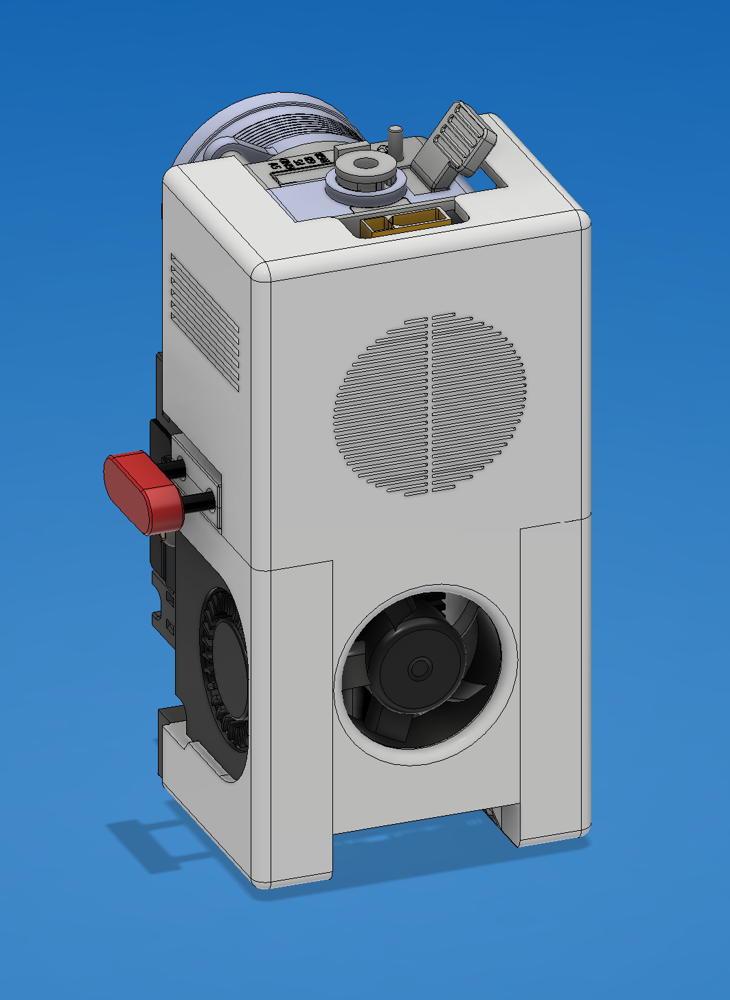
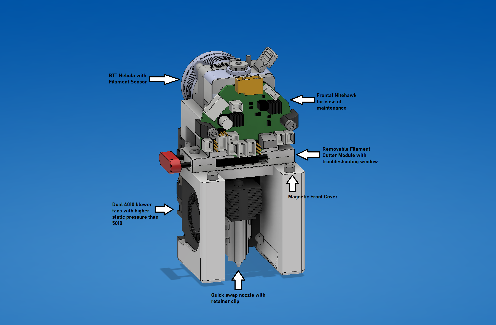
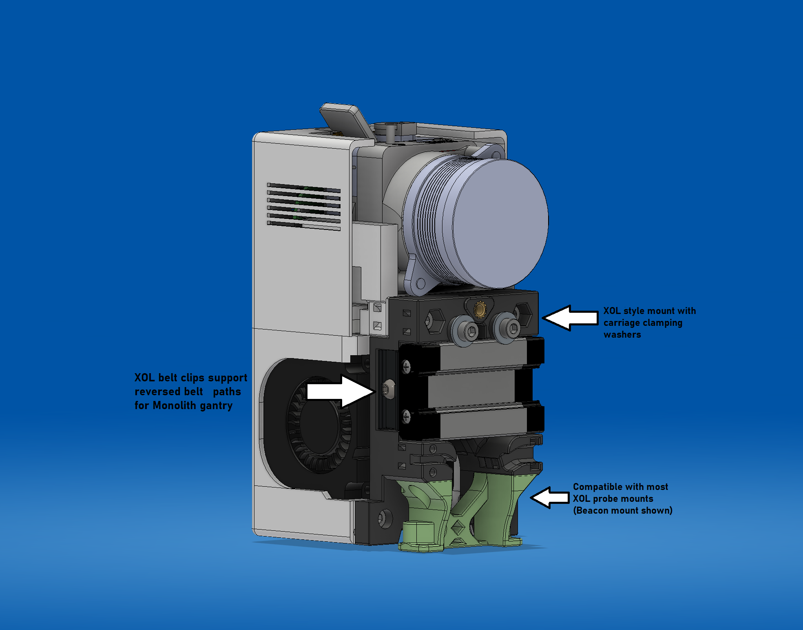

# YumBum-Toolhead
Yet Uh-nother Multifilament toolhead. Design intentions were to combine multiple nice-to-have features into one easy to maintain toolhead without a strict focus on mass reduction or balance. Physical dimensions are still smaller and lighter than a stealthburner. 

### Toolhead

### Front View

### Back View

# Credits
https://github.com/chirpy2605/voron/tree/main/V0/Dragon_Burner

https://github.com/Armchair-Heavy-Industries/Xol-Toolhead